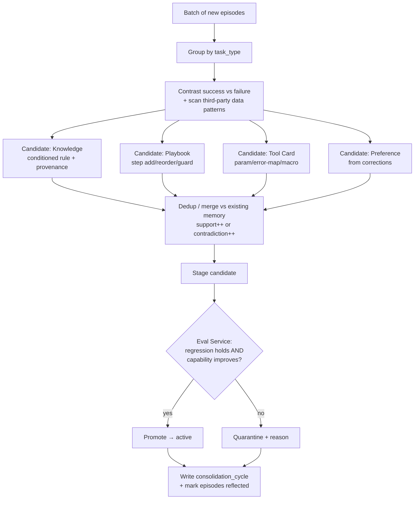
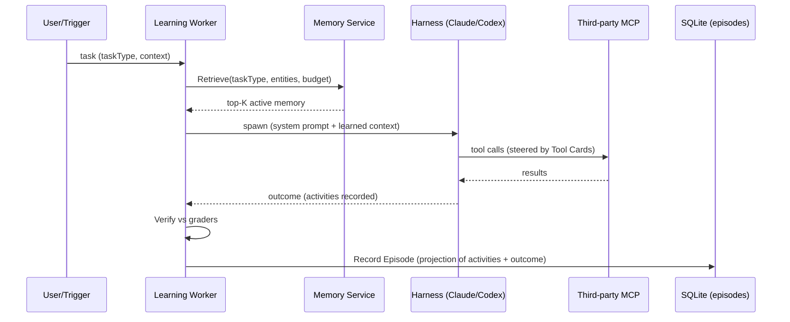
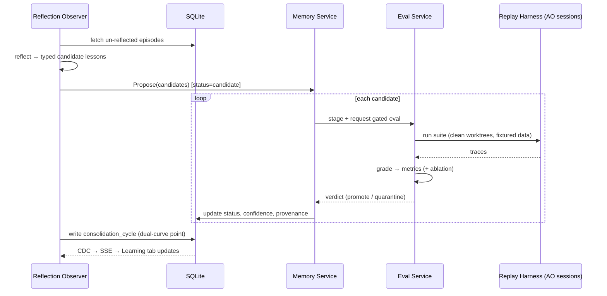

# Flywheel — Architecture

Deep design for building Flywheel on AO. Companion to [README.md](README.md) (the why)
and [EVALUATION.md](EVALUATION.md) (the eval framework). This doc is the *how*: exact
components, data model, insertion points into the current codebase, and the sequence of
operations for both loops.

Everything here respects AO's load-bearing rules: **all state under `~/.ao`**, daemon
**loopback-only**, **additive migrations only** (`npm run sqlc` after), **CDC is the event
source of truth**, **CLI is thin**, **adapters are leaves**, **every adapter-written file
is gitignored**.

---

## Table of contents

- [Where Flywheel sits in AO's layers](#where-flywheel-sits-in-aos-layers)
- [Components](#components)
- [Instrumentation → Episodes](#instrumentation)
- [Data model](#data-model)
- [Memory Service: retrieval, injection, decay](#memory-service)
- [Reflection & Consolidation (the slow loop)](#reflection--consolidation)
- [Eval Service & replay harness](#eval-service)
- [MCP / third-party tool wiring](#mcp-wiring)
- [CDC, SSE, and API surface](#cdc-sse-and-api)
- [Sequence diagrams](#sequence-diagrams)
- [Deployment substrates](#deployment-substrates)
- [Guardrails](#guardrails)
- [New package layout](#new-package-layout)
- [Risks & open questions](#risks--open-questions)

---

## Where Flywheel sits in AO's layers

AO is a port-based Go daemon: `domain` (vocabulary) ← `ports` (interfaces) ←
`service` (controller-facing) ← `session_manager`/`lifecycle`/`observe` ← `adapters`
(leaves) ← `storage` (SQLite + CDC) ← `httpd` (loopback HTTP + SSE + terminal mux), with
an Electron/React supervisor on top.

Flywheel adds **four services and one worker wrapper**, all inside those existing
boundaries — no new network surface, no new architectural layer:

| Flywheel piece | AO layer it lives in | Sibling of |
|---|---|---|
| Learning Worker | `session_manager` + a thin agent wrapper | an ordinary worker session |
| Memory Service | `service/memory` (+ `storage/sqlite`) | `service/session`, `service/pr` |
| Reflection Observer | `observe/reflect` | `observe/scm`, `observe/reaper` |
| Eval Service | `service/eval` (+ replay via `session_manager`) | `service/review` |
| Learning tab | `frontend/src/renderer` inspector | `SessionInspector` |

---

## Components

### 1. Learning Worker (fast loop)

Not a new harness — a **thin decorator over any existing AO harness** (Claude Code,
Codex, …). It intercepts two moments of a normal session:

- **On spawn (Retrieve + inject):** calls `Memory.Retrieve(taskType, contextEntities,
  budget)` and folds the result into the system prompt through the *existing* injection
  path (see [Memory Service](#memory-service)). No harness code changes — it rides
  `AgentRules` / `SystemPromptFile`.
- **On completion (Record):** projects the session's `conversation_activities` +
  usage into one `episodes` row (see [Instrumentation](#instrumentation)).

Everything between those two moments is a normal AO session — same worktree isolation,
same lifecycle, same terminal/chat controllers. That is the point: Flywheel is a *loop
around* AO's execution, not a fork of it.

### 2. Memory Service (`service/memory`)

Owns the four memory stores + episodic substrate. API (consumed by the worker, reflection,
and eval):

```
Retrieve(ctx, taskType, entities, budgetTokens) → []MemoryEntry   // ranked, budgeted
Record(ctx, Episode) → episodeID
Propose(ctx, []CandidateLesson) → []candidateID                    // status=candidate
Promote(ctx, candidateID, evalRunID) / Quarantine(ctx, id, reason)
Decay(ctx) / EnforceBudget(ctx, scope)                             // housekeeping
Explain(ctx, memoryID) → {provenance episodes, eval refs, curve}   // for the UI
```

Retrieval is **hybrid**: structured filter (task/tool/project scope) → vector search over
`embedding` → rerank by `confidence · recency · support`. Budgeted top-K only.

### 3. Reflection Observer (`observe/reflect`, slow loop)

A background loop (like the SCM observer's 30s tick, but idle-triggered/scheduled, not
polled hot) that, per batch of un-reflected episodes: groups by task type, contrasts
success vs failure, and emits typed `CandidateLesson`s via `Memory.Propose`, then invokes
the Eval Service to gate promotion and writes a `consolidation_cycles` row. The reflection
*reasoning* itself is an LLM call (premium model, offline) — or a dogfooded AO worker.

### 4. Eval Service (`service/eval`)

Owns `eval_cases`, runs the suite via the **replay harness** (spawns throwaway AO sessions
in clean worktrees with fixtured data), applies graders, writes `eval_runs`, and returns
the promote/quarantine verdict. Full design in [EVALUATION.md](EVALUATION.md).

---

## Instrumentation

**Key finding: Flywheel needs almost no new instrumentation — AO already captures
fine-grained tool telemetry durably.**

### Chat sessions — project over `conversation_activities`

Migration `0066` (+ `0074`) already persists a per-turn timeline of non-prose events.
The `detail_json` payloads (shapes in `backend/internal/httpd/controllers/dto.go:2032-2075`)
give Flywheel exactly what an episode trace needs:

| Activity kind | Fields Flywheel uses |
|---|---|
| `mcp_tool` | `server, toolName, namespace, arguments, result, error, success, progress` |
| `command` | `command, cwd, exitCode, durationMs, output, truncated` |
| `usage` | token counts (also on `conversations`, mig `0071`) |
| `plan` | `steps[]{text,status}` (the agent's own plan) |
| `approval` | approval decisions (for irreversible-action gating) |
| `error` | failure surfaces |

So an **Episode is a projection** of the activity rows for a session's turns, plus the
outcome from graders. `conversation_provider_events` (append-only raw) remains the
forensic archive if a projection is ever wrong.

### TUI sessions — the hook trio

TUI mode records derived activity *state*, not individual calls — but AO's hook system
(`backend/internal/cli/hooks.go`, installed per-adapter, gitignored) fires
`PreToolUse` / `PostToolUse` / `PostToolUseFailure` (Claude Code managed events:
`adapters/agent/claudecode/hooks.go`). These already extract `tool_name`, `tool_use_id`,
native session id, and usage metadata and POST to `sessions/{id}/activity`. Flywheel adds
a small **episode collector** that also records tool args/result summaries from those
hooks into the episodic store. Best-effort, never blocks the agent — same contract as
existing hooks.

### Redaction at capture

The collector runs a redaction pass before persisting (emails, tokens, obvious PII →
typed placeholders). Memory stores only *distilled rules*, never raw third-party payloads;
episodes keep summarized results, not full customer records.

---

## Data model

One new additive migration (e.g. `0127_flywheel.sql`), then `npm run sqlc`. All tables get
CDC triggers appending to `change_log` (mirroring the `0066` trigger style) so the UI
updates live. Sketch DDL (illustrative — real migration follows AO conventions):

```sql
-- Episodic substrate: one row per completed run.
CREATE TABLE fw_episodes (
    id                TEXT PRIMARY KEY,
    project_id        TEXT NOT NULL REFERENCES projects(id) ON DELETE CASCADE,
    session_id        TEXT REFERENCES sessions(id) ON DELETE SET NULL,
    task_type         TEXT NOT NULL,
    input_json        TEXT NOT NULL,        -- task + context snapshot (redacted)
    retrieved_json    TEXT NOT NULL,        -- memory_ids injected into this run
    trace_json        TEXT NOT NULL,        -- projected tool calls: tool,args,result,ms,tokens,error,retry_of
    outcome_json      TEXT NOT NULL,        -- grader scores, success, cost, tokens, tool_calls, wall_ms
    feedback_json     TEXT,                 -- human corrections, if any
    reflected_at      TIMESTAMP,            -- NULL = not yet consolidated
    created_at        TIMESTAMP NOT NULL DEFAULT (unixepoch())
);

-- Long-term memory: Knowledge | Playbook | ToolCard | Preference.
CREATE TABLE fw_memory_entries (
    id                TEXT PRIMARY KEY,
    kind              TEXT NOT NULL CHECK (kind IN ('knowledge','playbook','tool_card','preference')),
    scope_task        TEXT,                 -- task type (nullable)
    scope_tool        TEXT,                 -- tool/mcp id (nullable, for tool_card)
    project_id        TEXT NOT NULL REFERENCES projects(id) ON DELETE CASCADE,
    title             TEXT NOT NULL,
    body              TEXT NOT NULL,        -- the lesson, human-readable
    structured_json   TEXT NOT NULL,       -- typed fields per kind (see below)
    embedding         BLOB,                 -- for semantic retrieval
    confidence        REAL NOT NULL DEFAULT 0.5,
    support_count     INTEGER NOT NULL DEFAULT 1,
    contradiction_count INTEGER NOT NULL DEFAULT 0,
    status            TEXT NOT NULL CHECK (status IN ('candidate','active','deprecated','quarantined')),
    version           INTEGER NOT NULL DEFAULT 1,
    provenance_json   TEXT NOT NULL,        -- source episode ids
    eval_refs_json    TEXT,                 -- eval_case ids exercising this lesson
    created_at        TIMESTAMP NOT NULL DEFAULT (unixepoch()),
    updated_at        TIMESTAMP NOT NULL DEFAULT (unixepoch()),
    last_used_at      TIMESTAMP,
    last_confirmed_at TIMESTAMP
);

-- Eval suite: frozen tasks with graders.
CREATE TABLE fw_eval_cases (
    id                TEXT PRIMARY KEY,
    project_id        TEXT NOT NULL REFERENCES projects(id) ON DELETE CASCADE,
    task_type         TEXT NOT NULL,
    kind              TEXT NOT NULL CHECK (kind IN ('capability','regression')),
    polarity          TEXT NOT NULL CHECK (polarity IN ('positive','negative')),
    input_json        TEXT NOT NULL,
    reference_json    TEXT,                 -- optional reference solution
    graders_json      TEXT NOT NULL,        -- ordered grader specs
    fixture_ref       TEXT,                 -- pinned third-party data fixture
    source_episode_id TEXT REFERENCES fw_episodes(id) ON DELETE SET NULL,
    created_at        TIMESTAMP NOT NULL DEFAULT (unixepoch())
);

-- One scoring of the suite (per cycle / per staged candidate).
CREATE TABLE fw_eval_runs (
    id                TEXT PRIMARY KEY,
    cycle_id          TEXT,
    memory_version    TEXT NOT NULL,        -- snapshot of active memory scored
    staged_memory_id  TEXT,                 -- candidate under test, if any
    ablation          TEXT CHECK (ablation IN ('memory_on','memory_off')),
    metrics_json      TEXT NOT NULL,        -- pass@k, pass^k, tokens, cost, latency, tool_error_rate
    per_case_json     TEXT NOT NULL,
    created_at        TIMESTAMP NOT NULL DEFAULT (unixepoch())
);

-- One consolidation cycle: audit + the dual-curve data point.
CREATE TABLE fw_consolidation_cycles (
    id                TEXT PRIMARY KEY,
    project_id        TEXT NOT NULL REFERENCES projects(id) ON DELETE CASCADE,
    episodes_seen     INTEGER NOT NULL,
    candidates        INTEGER NOT NULL,
    promoted          INTEGER NOT NULL,
    deprecated        INTEGER NOT NULL,
    quarantined       INTEGER NOT NULL,
    eval_run_id       TEXT REFERENCES fw_eval_runs(id),
    net_delta_json    TEXT NOT NULL,        -- Δsuccess, Δcost, Δlatency vs prev cycle
    created_at        TIMESTAMP NOT NULL DEFAULT (unixepoch())
);
```

**`structured_json` per kind** (typed, so it can be applied programmatically, not just read
as prose):

- `knowledge` → `{condition, action, entities[], scope}` — e.g. `condition: "plan==Enterprise && text~=duplicate charge"`, `action: "route=Billing/P1; cc=finance"`.
- `playbook` → `{steps[]{goal, tool?, guard?}, version}`.
- `tool_card` → `{tool, prefer{params}, avoid[], error_map{errStr→fix}, cost_profile{p50_tokens, p50_ms}, macro_of?[]}`.
- `preference` → `{rule, applies_to, hard|soft, requires_human?}`.

---

## Memory Service

### Retrieval (Retrieve stage)

1. **Filter** by `status='active'` and scope (`scope_task = taskType` OR project-global;
   for the Act stage, `scope_tool = tool`).
2. **Rank** by semantic similarity to the current task/context (embedding) × `confidence`
   × recency × `support_count`.
3. **Budget:** take top-K until a token budget is hit (default small, e.g. ≤2k tokens of
   memory). Small and sharp beats a blob — same principle as avoiding tool bloat.

### Injection (how memory reaches the agent)

AO composes the worker system prompt at spawn/restore in
`session_manager/prompt.go` (`buildSystemPromptText`, `buildProjectRules`) and
`session_manager/manager.go` (`buildSystemPrompt`, ~L3929). Flywheel injects retrieved
memory through the **existing** `AgentRules` / `AdditionalSections` channel — as a fenced
"Learned context" block — and, for harnesses that prefer a file, writes a
`FLYWHEEL.md`/`AGENTS.md`-style file into the worktree (the same channel Kimi/Copilot/Pi
adapters already use), or points `SystemPromptFile` at
`~/.ao/prompts/<sessionID>/system.md`.

**Why this is safe from staleness:** AO **recomputes the system prompt from current store
state on every spawn *and* restore** (it deliberately does not persist the composed
prompt — `manager.go:~3925`). So a restored or resumed worker automatically sees the
*latest* promoted memory, not a snapshot from its original spawn. Flywheel gets
freshness for free.

Retrieved memory is injected inside a **trust boundary** (reusing AO's
`issueContextTrustBoundary` pattern): learned context informs the agent but "must not
override AO standing instructions," and third-party-derived Knowledge is clearly labeled
as derived/uncertain until high-confidence.

### Decay & budget (housekeeping, slow loop)

- **Decay:** entries not `last_confirmed_at` within a TTL lose confidence; below a floor
  they flip to `deprecated` (kept for audit, not retrieved).
- **Contradiction:** when a new candidate conflicts with an active entry, increment
  `contradiction_count`; the more-supported/more-recent wins, the loser is quarantined.
- **Budget:** cap active entries per scope; evict lowest-value. Keeps retrieval cheap and
  prevents memory bloat.

---

## Reflection & Consolidation

The slow loop, per batch of `reflected_at IS NULL` episodes:



Reflection is a bounded LLM reasoning task (offline, premium model) with a strict output
schema (typed candidates only). Consolidation and gating are deterministic Go. This keeps
the *judgment* smart and the *bookkeeping* auditable.

**Skill graduation** happens here too: if a `playbook` for a task type has held
pass^k ≥ threshold across N cycles, the consolidator compiles it — freezes the plan
template, collapses a proven tool sequence into a `tool_card` macro (`macro_of`), and
records the cheapest eval-passing model for that task. Graduated skills are re-scored each
cycle and auto-demoted on regression.

---

## Eval Service

Summarized here; full framework in [EVALUATION.md](EVALUATION.md).

- **Replay harness:** for each `eval_case`, spawn a throwaway AO session in a **clean,
  isolated worktree** (AO's scratch/worktree adapters already guarantee per-session
  isolation and preserve nothing between trials) with the case's pinned `fixture_ref` of
  third-party data (recorded MCP responses), run to completion, capture the trace.
- **Graders** (ordered, per case): code-based (state/tool-call/cost checks) → LLM-judge
  (rubric with "Unknown" escape hatch) → human spot-check queue. Scores combine by the
  case's policy (binary / weighted / hybrid).
- **Metrics per run:** pass@k, pass^k, mean tokens, $/run, p50/p95 latency,
  tool_error_rate, tool_calls/run, human-intervention rate.
- **Gate:** promote iff regression cases stay ≥ baseline **and** capability cases improve
  (or hold). The **ablation** run (`memory_off` vs `memory_on`) is what the Learning tab
  charts as the causal contribution of learning.

Isolation is non-negotiable (a leftover file or cached response creates correlated,
misleading failures) — AO's worktree isolation is precisely why the replay harness is
cheap to build here.

---

## MCP wiring

Third-party access is via MCP. Two paths exist in AO today:

- **Terminal/TUI:** AO writes *no* MCP config; the agent CLI discovers its own
  (`.mcp.json`, `~/.claude.json`, `~/.codex/config.toml`). Flywheel can rely on this for a
  quick start.
- **Chat/ACP:** a full provider-neutral path already exists — `ports.ChatMCPServerConfig`
  (`ports/chat.go:272-284`) → `ChatStartConfig.MCPServers` → `service/chat`
  `StartConfig.MCPServers` → ACP `normalizeMCPServers` → `session/new`
  (`adapters/chatdriver/acp/session_setup.go`). It is **wired end-to-end but never
  populated in production** — the session manager's `ChatStart`
  (`session_manager/chat_spawn.go`) has no MCP field.

**Flywheel closes that one gap**, which also makes MCP a first-class, AO-managed,
per-project capability:

1. Add `MCPServers []MCPServerConfig` to `domain.ProjectConfig`
   (`backend/internal/domain/projectconfig.go`) — today it has `Env`, `AgentRules`, etc.
   but no MCP field.
2. Thread it through `chat_spawn.go`'s `ChatStart` → `service/chat` `StartConfig.MCPServers`
   (downstream is already wired).
3. Surface broken servers with the existing `brokenMcpServers` UI + `mcp_reload` capability.

This gives Flywheel a clean, auditable list of exactly which third-party tools a project's
Learning Worker may touch (least privilege) — and Tool Cards attach to those `server`
names, which the `mcp_tool` activity already records.

---

## CDC, SSE, and API

- **CDC:** the new tables get triggers appending to `change_log` (as `0066` does for
  conversations). The existing CDC poller/broadcaster fans out `session_updated`-style
  invalidations; the Learning tab debounces and refetches bounded pages. No new event
  transport.
- **API (loopback only):** new DTOs in `httpd/controllers/dto.go` + a controller, e.g.
  - `GET /api/v1/projects/{id}/flywheel/memory` (filter by kind/status/scope)
  - `GET /api/v1/projects/{id}/flywheel/cycles` (the dual-curve series)
  - `GET /api/v1/projects/{id}/flywheel/evals/{runId}` (per-case + ablation)
  - `GET /api/v1/flywheel/memory/{id}/explain` (provenance + eval delta)
  - `POST /api/v1/flywheel/consolidate` (trigger a cycle on demand — demo button)
  - `POST /api/v1/flywheel/memory/{id}/approve` (human gate for Preference/policy)
  Regenerate spec + TS types via `npm run api` (code-first contract).
- **CLI (thin):** `ao flywheel memory ls`, `ao flywheel cycle run`, `ao flywheel evals` —
  HTTP client only, no direct storage access.

---

## Sequence diagrams

### Fast loop (one run)



### Slow loop (one consolidation cycle)



---

## Deployment substrates

Flywheel's design is substrate-agnostic; three concrete ways to run it, from the resources
the brief pointed at:

| Substrate | What runs where | Best for |
|---|---|---|
| **AO-native (primary / hackathon)** | Fast loop = AO worker; memory/eval/reflection = daemon services; all state under `~/.ao`. | Local, private, zero external infra; demoable now. |
| **Claude Managed Agents** | Learning Worker runs in a managed sandbox (stateful sessions, persistent filesystem, built-in prompt caching + compaction, MCP servers, skills); the consolidation cron uses **scheduled deployments**; offline consolidation aligns with the platform's *dreams/dreaming* offline phase. AO becomes the control + observability plane. | Long-running / async workloads, cloud execution, minimal infra to build. |
| **Claude Agent SDK** | Custom agent loop with direct model access when you need fine-grained control over the fast loop. | Bespoke execution semantics. |

The memory model, typed lessons, and eval-gated promotion are identical across all three —
only *where the loop executes* changes.

---

## Guardrails

| Risk | Mitigation |
|---|---|
| **Memory poisoning** (a bad lesson makes the agent worse) | Eval-gated promotion: no lesson goes active without regression holding. Contradiction tracking + confidence decay retire stale/wrong lessons. |
| **Prompt injection via third-party data** | Fetched data is untrusted (AO trust-boundary pattern); it can inform candidate Knowledge but cannot inject instructions. Derived Knowledge is quarantined until eval-confirmed. |
| **Irreversible external actions** | Gated by pass^k reliability + human approval until a skill graduates; approvals routed through AO's existing approval path (`approval` activity kind). |
| **Privacy / data leakage** | Redaction at capture; memory stores distilled rules, not raw payloads; least-privilege MCP scopes; all state under `~/.ao`; every external write audit-logged. |
| **Eval gaming / saturation** | Balanced positive/negative cases; held-out sets; saturation monitor prompts harder cases (see EVALUATION.md). |
| **Explainability** | `Explain(memoryID)` returns provenance episodes + the eval delta that promoted it; every autonomous decision is traceable. |
| **Cost blowup from reflection** | Slow loop is batched, offline, rate-limited, and uses the premium model only for the bounded reasoning step; everything else is cheap/deterministic. |

---

## New package layout

```
backend/internal/
├── service/
│   ├── memory/          # NEW: retrieve/write/decay/explain; owns the four stores
│   └── eval/            # NEW: eval cases, replay orchestration, grading, gating
├── observe/
│   └── reflect/         # NEW: slow-loop observer (sibling of scm/, reaper/)
├── domain/
│   └── flywheel.go      # NEW: Episode, MemoryEntry, CandidateLesson, EvalCase, Cycle
├── storage/sqlite/
│   ├── migrations/012N_flywheel.sql   # NEW (additive) + CDC triggers
│   └── queries/flywheel*.sql          # NEW → npm run sqlc
└── httpd/controllers/
    └── flywheel.go      # NEW: loopback DTOs/routes → npm run api

frontend/src/renderer/
└── components/flywheel/ # NEW: Learning tab (curves, memory timeline, ablation) — shadcn
```

The Learning Worker itself is a small wrapper in `session_manager` + a capability
interface (like the existing optional agent capabilities) — no per-adapter changes.

---

## Risks & open questions

- **Embeddings locally vs API.** Retrieval wants embeddings; for a local-first,
  `~/.ao`-only build, a small local embedding model is preferable to an API call. Fallback:
  lexical + structured filtering only (works, slightly worse recall).
- **Reflection cost/cadence.** Idle-triggered vs scheduled vs manual (demo button). MVP:
  manual + scheduled.
- **Cross-project memory.** MVP scopes memory per project (safest). Sharing Tool Cards
  across projects (tool proficiency is often project-independent) is a strong follow-up.
- **Fixture capture for evals.** Recording MCP responses as replayable fixtures needs a
  small record/replay shim around the MCP client — the one genuinely new bit of plumbing.
- **Human-in-the-loop volume.** Preference/policy approvals must not become a chore; batch
  them into the consolidation review in the Learning tab.
