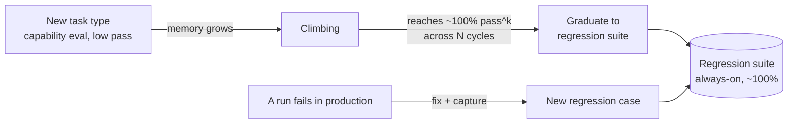
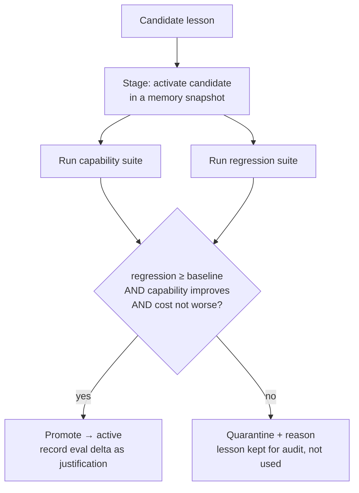

# Flywheel — Evaluation Framework

> *"Evaluation is necessary for any agent."*

In most agents, evals are a QA afterthought. In Flywheel, **evals are the fitness
function of the entire system**. They do three load-bearing jobs at once:

1. **Gate memory** — decide which learned lessons are allowed to become "active."
2. **Prove improvement** — produce the dual curve (quality up, cost down) that answers
   *"can you show it getting better?"*
3. **Catch regressions** — from model upgrades, third-party API drift, or a bad lesson.

This framework adapts Anthropic's *Demystifying evals for AI agents* methodology to a
**self-improving, tool-using** agent. Companion to [ARCHITECTURE.md](ARCHITECTURE.md).

---

## Table of contents

- [Terminology](#terminology)
- [What we measure](#what-we-measure)
- [Outcome vs trajectory, capability vs regression](#the-two-key-axes)
- [Grader taxonomy](#grader-taxonomy)
- [pass@k vs pass^k](#passk-vs-passk)
- [Evaluating tool use specifically](#evaluating-tool-use)
- [Building the dataset](#building-the-dataset)
- [The eval harness](#the-eval-harness)
- [Eval-gated promotion](#eval-gated-promotion-the-core-mechanism)
- [Turning metrics into the improvement chart](#turning-metrics-into-the-improvement-chart)
- [Saturation & maintenance](#saturation--maintenance)
- [Worked grader spec](#worked-grader-spec)
- [Zero-to-one checklist](#zero-to-one-checklist)

---

## Terminology

| Term | Meaning in Flywheel |
|---|---|
| **Task / case** | One test with inputs + success criteria (`fw_eval_cases`). |
| **Trial** | One attempt at a case (outputs vary, so we run several). |
| **Trajectory / transcript** | Full record of a trial: tool calls, args, results, reasoning, tokens. |
| **Outcome** | Final environment state (Linear issue exists with right team; reply sent). |
| **Grader** | Logic scoring one aspect of a trial; a case has several. |
| **Suite** | The set of cases for a task type (capability + regression). |
| **pass@k / pass^k** | Prob. of ≥1 success in k trials / prob. all k succeed. |
| **Ablation** | Same suite run with memory OFF vs ON — isolates learning's effect. |
| **Saturation** | Suite at ~100% — no signal left; time for harder cases. |

---

## What we measure

Every eval run emits a **vector**, not a single score — because Flywheel's whole claim is
that it improves *quality and efficiency together*:

- **Quality:** task success (pass^k for reliability-critical, pass@k for reversible),
  partial-credit score for multi-step tasks.
- **Correctness of contextual logic:** did it apply the right learned Knowledge rule?
  (routing accuracy, classification F1 on labeled cases).
- **Tool efficiency:** tool_calls/run, tool_error_rate, redundant-call rate.
- **Cost:** tokens/run, $/run.
- **Speed:** p50/p95 wall-clock.
- **Autonomy:** human-intervention rate (how often it had to ask).

The vector is what makes the dual curve possible and what stops the agent from "improving"
success by burning 3× the tokens.

---

## The two key axes

### Outcome vs trajectory

- **Outcome graders** verify the *final state* — the reservation exists in the DB, the
  Linear issue has the right team/priority, the email was actually sent. State beats
  self-report ("the agent said it filed the issue" is not "the issue exists").
- **Trajectory graders** verify *how* it got there — which tools, which params, how many
  turns, how many tokens.

Flywheel needs both: outcome for "did it work," trajectory for "did it work *efficiently
and safely*" (the efficiency curve, and the irreversible-action checks).

### Capability vs regression (and how lessons graduate)

- **Capability evals** ask *"can it do this?"* — they start low and are the hill the
  agent climbs as memory grows.
- **Regression evals** ask *"does it still work?"* — they must stay ~100%.

The lifecycle is the engine of monotonic improvement:



Two consequences: (1) **a fixed bug can never silently return** — its failure becomes a
permanent regression case; (2) **graduation triggers skill compilation** (see
ARCHITECTURE.md) — a task type that holds ~100% is safe to speed up and cheapen.

### Grade what was produced, not the exact path

We deliberately **avoid over-specifying step sequences**. Agents (and Flywheel's own
discovered Playbooks) find valid approaches the eval author didn't anticipate; a
path-constrained grader would punish exactly the creativity we want. We constrain the path
*only* where it matters for safety/cost (e.g. "must verify identity before refund"; "must
not exceed 8 tool calls").

---

## Grader taxonomy

Three tiers, used in combination, cheapest-first:

| Tier | Strengths | Weaknesses | Use for |
|---|---|---|---|
| **Code-based** | fast, cheap, objective, reproducible | brittle to valid variation | state checks, tool-call verification, cost/turn budgets, static checks |
| **LLM-as-judge** | flexible, scalable, handles nuance | non-deterministic, costs, needs calibration | reply quality/tone, "is this routing reasonable," open-ended output |
| **Human** | gold standard | slow, expensive | calibrating the judge, spot-checks, ambiguous cases |

**LLM-judge discipline:** structured rubric scoring each dimension separately; an
**"Unknown" escape hatch** so the judge abstains instead of hallucinating; periodic
**calibration against human labels**. Reserve it for genuinely subjective dimensions —
never use a judge where a code check suffices (cheaper, deterministic).

**Combining scores** per case: `binary` (all graders must pass — for safety-critical),
`weighted` (threshold on a weighted sum — for quality), or `hybrid` (weighted quality
*and* binary safety gates). Multi-step cases carry **partial credit** so progress is
visible before full success.

**Read the transcripts.** Regular transcript audits are non-negotiable: they verify that
failures are *fair* (clear what went wrong and why), that graders aren't rejecting valid
solutions, and that case specs aren't ambiguous. A `0% pass@100` on a case almost always
means a broken case, not an incapable agent.

---

## pass@k vs pass^k

Both are computed; the **action's reversibility** picks which one gates it:

- **pass@k** (≥1 of k succeeds) — for **reversible** work: drafting a reply, proposing a
  classification a human will confirm. One good attempt is enough; approaches 100% as k
  grows.
- **pass^k** (all k succeed) — for **irreversible** external actions: sending an email,
  posting to Slack, closing a ticket, issuing a refund. Falls as k grows, exposing
  unreliability that pass@k hides. A skill may not graduate to autonomous irreversible
  execution until it holds pass^k above threshold.

This is why Flywheel can be *aggressive* about autonomy on reversible steps and
*conservative* on irreversible ones — the metric encodes the risk.

---

## Evaluating tool use

Tool use is central to the brief, so it gets first-class graders.

**Code-based tool-call verification** (declarative, per case):

```yaml
tool_calls:
  required:
    - {server: hubspot, tool: get_customer_context}          # enriched before deciding
    - {server: linear,  tool: create_issue, params: {team: "Billing", priority: "<=2"}}
  forbidden:
    - {server: slack, tool: list_channels}                   # anti-pattern: list-then-filter
  budget:
    max_tool_calls: 8
    max_tokens: 20000
```

Checks: required tools called, params within constraints, forbidden anti-patterns absent,
sequence where it matters for safety, budgets respected.

**Behavioral (LLM-judge) tool assessment:** "was the tool *choice* appropriate and
efficient?" — catches the case where the agent technically succeeded but took a wasteful
route.

**State verification:** confirm the tool's *side effect* actually happened (issue exists
in Linear, not just "create_issue returned 200").

**Anti-over-specification:** required/forbidden lists stay minimal — enough to catch
regressions and anti-patterns, not so rigid they forbid a better route Flywheel discovers.
Tracking tool-call *patterns* across trials is also how reflection spots consolidation
opportunities (repeated sequences → macro-tool).

---

## Building the dataset

**Start early, start small (20–50 cases).** Early on, effect sizes are large, so small
samples suffice; scale to hundreds as the agent matures and effects shrink.

Sources, in priority order:

1. **Real episodes** — Flywheel *manufactures its own eval cases from `fw_episodes`.* Every
   production run is a candidate case; every **failure becomes a regression case** once
   fixed. This is a major advantage of the loop: the eval suite grows automatically from
   real usage.
2. **Historical third-party data** — labeled outcomes already sitting in the tools (resolved
   Linear issues, past refund decisions) become ground-truth cases for contextual-logic
   evals.
3. **Domain-expert / user-authored** — the user marks a handful of "this is what good looks
   like" cases.

**Write unambiguous cases:** two independent reviewers should reach the same pass/fail; each
case must be solvable (attach a reference solution proving it, which also validates the
graders); graders check only what the case specifies.

**Balance positive and negative cases.** For a triage agent: cases where escalation *is*
correct **and** cases where it is *not*; where a learned rule *should* fire **and** where a
superficially-similar input *should not*. Class imbalance produces one-sided optimization
(an agent that escalates everything can score well on an all-escalation set).

---

## The eval harness

Correctness of the harness is as important as the graders — infra flakiness becomes fake
signal.

- **Isolation:** each trial runs in a **clean, throwaway AO worktree/session** with no
  shared state. AO's worktree/scratch isolation already guarantees this — it's why the
  harness is cheap to build here. Leftover files or cached responses cause *correlated*
  failures that look like real regressions.
- **Fixtured third-party data (record/replay):** MCP responses are recorded once into a
  pinned `fixture_ref` and replayed on every trial, so evals are deterministic and don't
  hammer (or mutate!) real third-party apps. This is the one genuinely new bit of plumbing
  — a small record/replay shim around the MCP client.
- **Identical to production:** the agent runs the same way in eval and prod (same harness,
  same retrieval/injection) so scores transfer.
- **Concurrency + reproducibility:** trials run in parallel; the same case+memory version is
  reproducible (modulo model non-determinism, which is why we run k trials).

---

## Eval-gated promotion (the core mechanism)

This is where evals *become* the learning controller. When reflection proposes a candidate
lesson:



Properties this buys:

- **Monotonic improvement / no drift.** Memory only changes through a gate that requires
  regression to hold. The agent can plateau but cannot silently regress.
- **Poison resistance.** One unlucky or adversarial episode cannot corrupt trusted memory —
  a lesson must *prove itself* on the suite first.
- **Justified memory.** Each active lesson stores the eval delta that promoted it
  (`eval_refs_json`), so the UI can show *why* it's trusted.

Preference/policy lessons and anything gating irreversible external actions additionally
require **human approval**, batched into the Learning tab's consolidation review.

---

## Turning metrics into the improvement chart

The metric vector, re-scored every consolidation cycle and stored in
`fw_consolidation_cycles.net_delta_json` + `fw_eval_runs.metrics_json`, is exactly the data
behind the three Learning-tab views:

1. **Dual curve** — pass^k (right axis) vs $/run + tokens + tool_calls + latency (left
   axis), one point per cycle. The visible proof that quality rises as cost falls.
2. **Memory timeline** — promotions/deprecations/quarantines per cycle (from cycle rows),
   each linking to the eval delta that justified it.
3. **Ablation** — `memory_off` vs `memory_on` on a held-out set; the gap is learning's
   causal contribution. *A lesson that doesn't beat its own ablation doesn't ship.*

Because these ride AO's CDC→SSE, the chart updates live as a cycle runs — the demo can show
memory being proposed and the curve moving in real time.

---

## Saturation & maintenance

- **Saturation monitor:** when a suite hits ~100%, it stops giving signal (big real
  improvements show as tiny score bumps). The monitor flags it and prompts harder cases —
  drawn automatically from the hardest recent episodes.
- **Held-out sets:** promotions are validated on cases not used to generate the lesson, to
  avoid overfitting memory to its own "training" episodes.
- **Maintenance as routine:** treat eval upkeep like unit-test upkeep. The user (and
  domain experts) can contribute cases directly; failures perpetually refill the regression
  suite. Combine automated evals with production monitoring, occasional human studies (to
  recalibrate the judge), and transcript sampling.

---

## Worked grader spec

A single `fw_eval_case` for the support-triage task (illustrative):

```yaml
id: case-triage-ent-dupcharge-014
task_type: support_triage
kind: capability            # will graduate to regression once stable
polarity: positive
input:
  source: intercom
  message: "We've been charged twice for the November invoice."
  customer_ref: cust_8842   # resolves (in fixture) to HubSpot plan=Enterprise
fixture_ref: fx/triage/2026-08/ent-dupcharge   # pinned HubSpot+Linear+Slack responses
reference:
  team: Billing
  priority: 1
  cc: [finance]
  reply_contains: ["duplicate", "refund", "24 hours"]
graders:
  - type: code                # outcome: Linear side effect
    check: linear_issue_exists
    expect: {team: Billing, priority: "<=2", cc_includes: finance}
  - type: code                # trajectory: enriched before deciding
    check: tool_calls
    required: [{server: hubspot, tool: get_customer_context}]
    budget: {max_tool_calls: 8, max_tokens: 20000}
  - type: llm_judge           # quality: reply is empathetic, correct, concise
    rubric: [accuracy, empathy, brevity_<=120w, no_overpromising]
    escape_hatch: "Unknown"
  - type: code                # efficiency gate for the cost curve
    check: cost
    expect: {tokens: "<=20000", tool_errors: 0}
scoring: hybrid               # quality weighted; safety + state binary
reliability: pass^3           # irreversible (files an issue + drafts customer reply)
```

The **negative twin** of this case (a superficially similar message that should *not* be
P1 or CC finance) lives beside it, so a learned routing rule can't win by over-firing.

---

## Zero-to-one checklist

- [ ] Collect 20–50 cases from real episodes, historical data, and user-marked examples.
- [ ] Write each so two reviewers agree on pass/fail; attach a reference solution.
- [ ] Balance positive and negative cases; avoid class imbalance.
- [ ] Build the isolated harness: clean worktree per trial, fixtured MCP data, reproducible.
- [ ] Layer graders cheapest-first: code → LLM-judge (with escape hatch) → human spot-check.
- [ ] Grade outcomes, not exact paths; constrain the path only for safety/cost.
- [ ] Add partial credit for multi-step cases.
- [ ] Pick pass@k vs pass^k per action by reversibility.
- [ ] Wire eval-gated promotion; require human approval for policy/irreversible lessons.
- [ ] Read transcripts every cycle; make sure failures are fair.
- [ ] Monitor saturation; auto-refill hard cases from recent failures.
- [ ] Plot the dual curve + ablation in the Learning tab.
