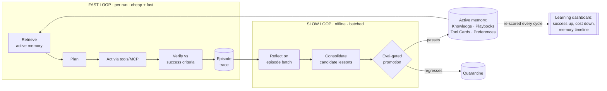
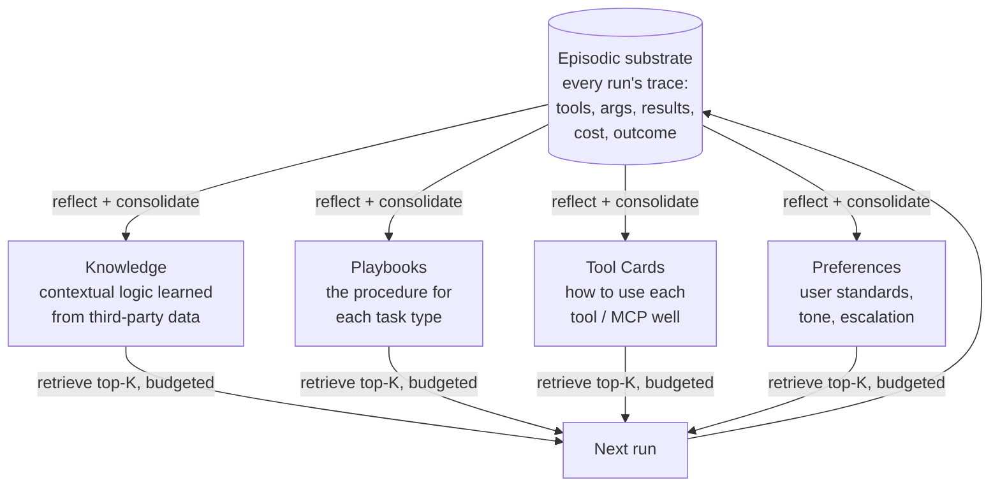
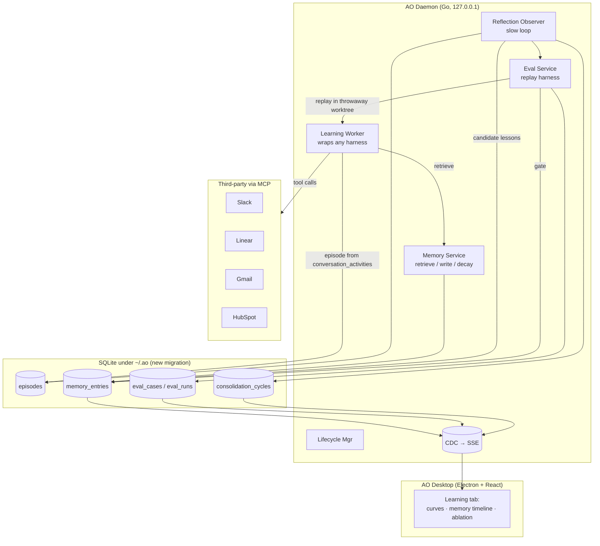

# Flywheel

**A self-improving agent runtime for AO — an agent that *compounds*.**

> Give it access to a few third-party apps (via MCP/APIs) and a recurring, fuzzy
> task. On run #1 it is a competent generalist. By run #50 it is a specialist at
> *your* workflow, on *your* data — measurably faster, cheaper, and more correct —
> because every run leaves behind distilled, eval-verified memory that the next run
> stands on.

Flywheel is a design for the AO hackathon. It is not "add a `memory.md` file." It is
a disciplined **experiential learning system**: a fast execution loop, a slow
consolidation loop, four typed long-term memories, and an **evaluation harness that
gates what the agent is allowed to remember** — so the agent gets better without ever
getting worse.

---

## The four questions, answered up front

The brief asks four questions. Here is the whole design in one table; the rest of this
doc is the depth behind each cell.

| Question | Flywheel's answer | Where |
|---|---|---|
| **How does it get better over time?** | A closed loop: every run is instrumented into an **episode**; an offline **reflection** pass distills episodes into candidate lessons across four typed memories (Knowledge, Playbooks, Tool Cards, Preferences); an **eval harness gates promotion** so only lessons that provably raise success/cut cost become "active." Next run *retrieves* the active memory and stands on it. | [§ The Flywheel loop](#the-flywheel-loop) · [§ Memory](#the-four-memories-plus-a-substrate) |
| **Can you show it getting better through self-reflection + growing memory?** | Yes — improvement is a *first-class, plotted artifact*. A frozen eval suite is re-scored every consolidation cycle; the **Learning tab** in AO plots success (pass^k) rising while $/run, tokens, tool calls and latency fall, next to a **memory timeline** (lessons proposed → promoted → deprecated) and an **A/B ablation** (memory OFF vs ON). | [§ Showing improvement](#showing-improvement-q2) · [EVALUATION.md](EVALUATION.md) |
| **Can it learn complex contextual logic from third-party data and reuse it?** | Yes — that is the **Knowledge memory**. Reflection mines patterns across historical third-party data (e.g. 6 months of Linear issues + their Slack threads) into typed, conditioned rules with provenance and confidence, eval-gated before use, then applied on later runs. Every applied rule is traceable to the episodes that taught it. | [§ Learning contextual logic](#learning-contextual-logic-from-third-party-data-q3) |
| **Is it cost-effective and fast?** | It gets *cheaper and faster as it learns*. Levers: model routing (Haiku/Sonnet/Opus by learned difficulty), **skill graduation** (mastered, eval-stable procedures compile into cached plans and single macro-tools), prompt-cached memory prefixes, retrieval budgeting, learned concise tool-response shaping, and **offline consolidation off the critical path**. | [§ Cost and speed](#cost-and-speed-q4) |

---

## The problem: today's agents don't compound

A modern coding/ops agent is brilliant and **amnesiac**. Point it at the same recurring
task 50 times and run #50 is no better than run #1:

- **It re-learns the tools every time.** It rediscovers that `search_contacts` beats
  `list_contacts`, re-hits the same rate-limit, re-guesses the same parameter, re-reads
  the same 20k-token log — every single run. Tool knowledge evaporates at session end.
- **It re-derives your context every time.** It never notices that invoices from *Acme*
  are always NET-30, that `#billing` questions are 80% refund-related, or that your
  sprint closes Thursday — even though the answer is sitting in the data it already read.
- **It has no idea if it's good.** There is no scorecard, so "it feels worse after the
  model upgrade" is unfalsifiable and un-fixable.
- **It gets more expensive with competence, not less.** Mastery should mean *doing the
  routine part cheaply*. Instead every run pays full reasoning price.

AO is the ideal host to fix this. It already gives every task an isolated worktree, a
durable conversation timeline, fine-grained tool-call telemetry
(`conversation_activities` with an `mcp_tool` kind), a lifecycle/observer architecture,
CDC→SSE for live UI, and a persistent project-scoped orchestrator. **What AO does not
have — confirmed by a full sweep of the repo — is any mechanism by which an agent writes
knowledge back for its future self to read.** Flywheel is exactly that missing loop.

---

## Core thesis

Three ideas do all the work.

1. **Two loops, not one.** Separate the **fast loop** (execute the task, cheaply, now)
   from the **slow loop** (reflect on batches of runs and rewrite memory, offline). The
   fast loop must stay cheap and fast; all the expensive "thinking about how to improve"
   happens off the critical path — the same split as capability-eval → regression-eval in
   Anthropic's eval methodology, and the same spirit as an offline consolidation /
   "dreaming" phase.

2. **Typed memory, not a blob.** "Getting better" is really four different learning
   problems — *world knowledge*, *procedure*, *tool proficiency*, and *taste*. Each gets
   its own store, its own write path, its own retrieval, and its own confidence/decay.
   A blob memory file cannot be scored, deduped, decayed, or safely rolled back; typed
   records can.

3. **Evals gate memory.** A lesson is a *hypothesis*, not a fact. It becomes "active"
   memory **only if it passes the eval suite** without regressing anything. This is the
   difference between an agent that learns and an agent that drifts — it makes
   improvement monotonic and *provable*, and it is the mechanism behind the "show it
   getting better" chart.



---

## The Flywheel loop

Eight stages. The first five are the fast loop (one per run); the last three are the
slow loop (one per consolidation cycle over a *batch* of runs).

| # | Stage | Loop | What happens |
|---|---|---|---|
| 1 | **Retrieve** | fast | Before acting, pull the top-K relevant memories for this *task type* + *current context entities*, within a token budget. Hybrid: structured filters (task, tool, project) + semantic search + confidence/recency ranking. |
| 2 | **Plan** | fast | Form a plan grounded in the retrieved **Playbook**. If a graduated (compiled) plan exists, skip re-planning entirely. |
| 3 | **Act** | fast | Execute via tools/MCP. Every tool call is instrumented: args, result summary, latency, tokens, errors, retries. Learned **Tool Cards** steer parameter choices and response shaping. |
| 4 | **Verify** | fast | Score the outcome against the task's success criteria using the *same graders the eval suite uses*. Self-check; request human sign-off for irreversible external actions. |
| 5 | **Record** | fast | Persist a structured **Episode** (input, retrieved-memory used, full trace, outcome scores, cost). Built directly from AO's `conversation_activities`. |
| 6 | **Reflect** | slow | A deliberate pass over a batch of recent episodes groups them by task, contrasts successes vs failures, and emits **candidate lessons** (typed, with provenance + proposed confidence). |
| 7 | **Consolidate** | slow | Dedup/merge candidates into existing memory (support raises confidence; contradiction quarantines); decay stale entries; enforce per-scope budgets so memory stays small and sharp. |
| 8 | **Promote** | slow | Stage candidates, run the eval suite, and **promote to active only if the regression suite holds and capability improves**. Otherwise quarantine with a reason. Policy/Preference lessons require human approval. |

The loop is self-hosting on AO: the fast loop is a **Learning Worker** (a thin wrapper
over any AO harness — Claude Code, Codex, …); the slow loop runs as a **Reflection
observer** (a background daemon loop, sibling to AO's SCM observer and reaper) or as a
scheduled AO worker; eval replay reuses AO's own session spawn in throwaway worktrees.

---

## The four memories (plus a substrate)

Everything sits on an **episodic substrate** — the raw/summarized traces of past runs —
which is *distilled* into four long-term stores. This split mirrors human memory
(episodic → semantic/procedural) and, crucially, lets each store be retrieved, scored,
and decayed independently.



| Memory | Answers | Example entry | Written by | Read at |
|---|---|---|---|---|
| **Knowledge** (semantic) | "What is true about *this* domain/data?" | *"Vendor Acme → NET-30; auto-approve invoices < $500 (support: 41 episodes, conf 0.94)."* | Reflection over third-party data patterns | Retrieve / Plan / Verify |
| **Playbooks** (procedural) | "What is the reliable procedure?" | *"Triage(ticket): 1) classify via Knowledge rules 2) if refund→link order 3) draft reply 4) route."* Versioned. | Reflection over successful trajectories | Plan |
| **Tool Cards** (tool proficiency) | "How do I use this tool/MCP well?" | *"`slack_search`: prefer `in:#billing after:` filters; `CONCISE` format; on `ratelimited` back off 30s; DON'T list-then-filter."* | Reflection over tool-call traces | Retrieve / Act |
| **Preferences** (policy/taste) | "What does the user consider *done/right*?" | *"Replies ≤120 words, no emoji; always CC finance on refunds > $1k; escalate legal wording."* | Reflection over corrections + explicit feedback | Plan / Verify |

Every memory record is a small structured row — not prose — carrying:

```
id · kind · scope{task,tool,project} · title · body · structured(JSON, typed per kind)
confidence(0..1) · support_count · contradiction_count · status{candidate|active|deprecated|quarantined}
provenance(episode_ids) · eval_refs(case_ids) · created/updated/last_used/last_confirmed · version · embedding
```

That shape is what makes learning *safe and legible*: confidence and contradiction
counts let bad lessons decay instead of accumulate; provenance makes every applied rule
explainable ("why did it do that?" → "Knowledge #K-217, conf 0.94, from 41 episodes");
`eval_refs` tie each lesson to the tests that justify it. Full DDL is in
[ARCHITECTURE.md](ARCHITECTURE.md#data-model).

---

## Learning to use tools better (the tool-learning problem)

The brief specifically asks about **learning to use tools/MCPs/APIs over time**. This is
the **Tool Card** store, and it is designed around Anthropic's *Writing tools for agents*
principles — with a twist: **Flywheel usually can't rewrite a third-party MCP tool, so it
learns a *usage layer* on top of it instead.**

A Tool Card accumulates, per tool, from real traces:

- **Preferred call shape** — which params, which values, which `response_format`. E.g.
  learns to pass `CONCISE` by default and only request `DETAILED` when it needs an ID
  downstream (the ~3× token saving from the article), and to make *many small targeted
  searches* rather than one broad one.
- **Error → fix map** — observed error strings mapped to the recovery that worked
  ("`invalid_cursor` → drop cursor, restart from page 1"; "`ratelimited` → backoff 30s").
  Turns a class of failures into a one-shot recovery next time.
- **Cost/latency profile** — measured tokens + ms per call pattern, feeding the router
  and the "prefer the cheap path" decision.
- **Anti-patterns** — "don't `list_*` then filter in-context; use the server-side
  `search_*`." Learned by spotting wasteful trajectories in reflection.

Two higher-order things fall out of Tool Cards over time:

1. **Macro-tools (consolidation).** When reflection sees the same multi-call sequence
   succeed repeatedly (`list_users` → `list_events` → `create_event`), it proposes a
   single composed **macro** (`schedule_event`) that runs the sequence deterministically
   under the hood — exactly the "consolidate multiple operations" guidance, but
   *discovered from usage* rather than hand-designed. Fewer tool calls, fewer tokens,
   fewer places to fail.
2. **Tool-doc self-repair.** Where Flywheel *does* own the MCP surface (AO's own tools),
   reflection can propose description/param-naming fixes (the article's "Claude kept
   appending 2025 to the query" class of bug) as candidate PRs — agent-assisted tool
   refinement, eval-gated like everything else.

Because AO already records `mcp_tool` activities with `server / toolName / arguments /
result / error / success`, Tool Cards can be built **without any new instrumentation** —
just a projection over existing telemetry. See [ARCHITECTURE.md](ARCHITECTURE.md#instrumentation).

---

## Evaluation: the backbone that makes "better" true

Everything hinges on evals — *"evaluation is necessary for any agent."* Flywheel treats
the eval suite as the **fitness function of the whole system**: it decides what gets
remembered, proves the agent is improving, and catches regressions from model upgrades or
third-party API drift. Full design in **[EVALUATION.md](EVALUATION.md)**; the essentials:

- **Trajectory *and* outcome graders.** Outcome graders check final state (the Linear
  issue exists with the right team/priority; the reply was sent). Trajectory graders check
  *how* (tools used, params within constraints, turn/token budgets). We grade **what was
  produced, not the exact path**, to avoid punishing creativity.
- **Three grader tiers.** Code-based (fast, cheap, objective: state checks, tool-call
  verification, cost thresholds) → LLM-as-judge with rubrics + an "Unknown" escape hatch
  (nuanced quality, calibrated against humans) → human spot-checks (gold standard,
  sampled).
- **Capability evals graduate into regression evals.** New task types start as a hill to
  climb; once at ~100% pass^k they move into the always-on regression suite. Fixed
  failures become new regression cases — so the same bug can never silently return.
- **pass@k vs pass^k, chosen per action.** Reversible drafting can use pass@k (one good
  attempt is enough). Irreversible external actions (send email, close ticket) are held
  to **pass^k** — reliability *every* time.
- **Eval-gated promotion.** A candidate lesson is staged, the suite re-runs, and the
  lesson is promoted only if capability improves and **regression holds**. This is the
  guardrail against *memory poisoning* — one unlucky run can never corrupt trusted memory.
- **Isolated, reproducible harness.** Each trial runs in a clean throwaway AO
  worktree/sandbox with fixtured third-party data, so trials don't contaminate each other.

---

## How it gets better over time (Q1)

Putting the loop and the memories together, improvement compounds along five distinct
axes — each with its own memory and its own visible curve:

1. **Tool proficiency ↑** (Tool Cards): fewer tool errors, fewer calls, cheaper call
   shapes.
2. **Procedural reliability ↑** (Playbooks): higher first-try success, fewer dead-ends
   and retries.
3. **Contextual accuracy ↑** (Knowledge): correct routing/decisions because it *knows*
   the domain rules now.
4. **Judgment ↑** (Preferences): fewer human corrections; output matches the user's bar.
5. **Efficiency ↑** (skill graduation + routing): the mastered part of the task gets
   compiled, cached, and pushed to a cheaper model.

The mechanism is monotonic by construction: memory only changes through eval-gated
promotion, and the eval suite only grows. So the agent can climb or plateau — but it is
architecturally prevented from silently sliding backwards.

---

## Showing improvement (Q2)

Improvement is not a claim in this design — it is a **rendered artifact**, surfaced in a
new **Learning tab** in AO's session inspector (dark theme, blue accent, shadcn
primitives, cloned from agent-orchestrator per the design system). Three views:

**1. The dual curve** — every consolidation cycle re-scores the frozen eval suite and
plots quality up / cost down on one chart. *Illustrative target trajectory for a support-
triage agent (numbers are the demo's goalposts, not measured results):*

| Cycle | Episodes seen | Active lessons | Success (pass^k) | Tool errors/run | Tool calls/run | Tokens/run | $/run | p50 latency |
|---:|---:|---:|---:|---:|---:|---:|---:|---:|
| 0 (cold) | 0 | 0 | 0.42 | 2.9 | 14 | 38k | $0.21 | 41s |
| 1 | 40 | 9 | 0.61 | 1.4 | 11 | 27k | $0.14 | 33s |
| 2 | 90 | 17 | 0.78 | 0.7 | 8 | 19k | $0.08 | 24s |
| 3 | 160 | 22 (3 deprecated) | 0.89 | 0.3 | 6 | 13k | $0.05 | 17s |
| 4 | 240 | 24 (graduated 2 skills) | 0.94 | 0.2 | 5 | 9k | $0.03 | 11s |

**2. The memory timeline** — a live feed (via CDC→SSE) of lessons being *proposed →
promoted → deprecated → quarantined* each cycle, each expandable to its provenance
episodes and the eval delta that justified it. This is literally "self-reflection and
memory growing," made watchable.

**3. The ablation** — the headline proof. Re-run a held-out set with **memory OFF vs
ON**; the gap is the causal contribution of learning. A memory that doesn't beat its own
ablation doesn't ship.

---

## Learning contextual logic from third-party data (Q3)

This is the **Knowledge** memory in action. A worked example (domain is illustrative — the
architecture is domain-agnostic):

**Task:** *"Triage incoming customer messages from Slack/Intercom: classify, enrich from
HubSpot, file or update a Linear issue, and draft a reply."* Third-party access: Slack,
Intercom, HubSpot, Linear (via MCP).

- **Run 1–20 (cold):** The agent triages competently but generically. It mislabels
  priority, routes billing questions to the wrong team, and asks the human to confirm
  routing often. Episodes capture every decision, tool call, and correction.
- **Consolidation cycle 1 — reflection mines the data.** Over the batch, reflection
  notices patterns *in the third-party data itself*, not just in its own behavior:
  - Messages containing "duplicate charge" + a HubSpot plan tier of *Enterprise* were, in
    18/19 resolved Linear issues, routed to **Billing/P1** and CC'd finance.
  - Threads in `#integrations` mentioning a 4xx were 90% actually auth-scope problems, not
    outages.
  It emits **Knowledge candidates**, each conditioned and carrying provenance
  (the 19 episode IDs) and a proposed confidence.
- **Promotion.** The candidates are staged; the eval suite (built partly from those same
  historical, now-labeled cases) re-runs. The routing rule lifts capability with no
  regression → **promoted to active**. The auth-scope rule is right but low-support →
  stays **candidate** until more episodes confirm it.
- **Run 21+ (warm):** On the next Enterprise "duplicate charge," the agent retrieves
  Knowledge #K-217, routes to Billing/P1, CCs finance, and drafts the reply — *without
  asking*. The Learning tab shows exactly which run first applied the rule and the
  provenance behind it.

The point: the agent learned a **non-obvious, domain-specific decision rule by analyzing
data it fetched from third-party tools**, verified it against evals, and applied it
autonomously later — with a full audit trail. That is contextual-logic learning, not
prompt-stuffing.

---

## Cost and speed (Q4)

Flywheel is engineered so **competence buys efficiency**. The levers:

- **Learned model routing.** A cheap model (Haiku) handles retrieval, classification, and
  grading; a mid model (Sonnet) plans/executes; a premium model (Opus) is reserved for
  genuinely hard cases and for the offline reflection reasoning. *Which* model a task type
  needs is not guessed — it's **determined by running the eval suite across models** and
  picking the cheapest that still passes.
- **Skill graduation (the big one).** When a Playbook is eval-stable across N cycles, it
  **compiles**: the plan is frozen into a parameterized template (no re-planning), a
  proven tool sequence collapses into a single macro-tool, and the executor downshifts to
  the cheapest passing model. Graduated skills are re-validated each cycle and *demoted*
  automatically if a regression appears (e.g. an MCP changed) — fast *and* robust.
- **Prompt-cached memory prefix.** Active memory for a task type is stable across runs, so
  it lives in a cacheable prompt prefix; only the dynamic task varies. Large, recurring
  cost win.
- **Retrieval budgeting.** Only top-K memories within a token budget are injected — small,
  sharp memory beats a giant blob (the same "more isn't better" lesson as tool bloat).
- **Concise-by-default tool responses.** Tool Cards learn to request filtered/`CONCISE`
  responses, cutting the tokens the agent has to read.
- **Offline consolidation.** All the expensive "how do I improve" reasoning is batched off
  the critical path (a background observer or scheduled run), so the fast loop stays fast.

Net effect: the dual curve above — **quality rises while $/run, tokens, and latency fall
run over run.** For long-running/async workloads this maps cleanly onto **Claude Managed
Agents** (managed sandbox, stateful sessions, prompt caching + compaction, scheduled
deployments for the consolidation cron); see [ARCHITECTURE.md](ARCHITECTURE.md#deployment-substrates).

---

## Architecture on AO (summary)

Flywheel is buildable on AO today, respecting every hard rule (all state under `~/.ao`,
loopback-only, additive migrations, CDC-as-source-of-truth, thin CLI, adapters-as-leaves).



**Concrete insertion points (all verified in the current codebase):**

- **Instrumentation → Episodes:** project over existing `conversation_activities`
  (`mcp_tool`, `command`, `usage`, …) for Chat sessions; `PreToolUse/PostToolUse/
  PostToolUseFailure` hooks for TUI. No new agent instrumentation needed.
- **Memory injection:** learned, active memory is compiled into the worker system prompt
  at spawn via the existing `AgentRules` / `AdditionalSections` path
  (`session_manager/prompt.go`, `manager.go:3929`). Because AO **recomputes the system
  prompt from store state on every spawn *and* restore**, retrieved memory is always
  current — no stale-prompt problem.
- **Memory as a file (optional):** mirror the proven **handoff-artifact** pattern
  (immutable JSON under `~/.ao/`, injected into the agent) for harnesses that prefer a
  `MEMORY.md`-style file (CLAUDE.md/AGENTS.md channel already used by several adapters).
- **Slow loop:** a new `observe/reflect` loop, sibling to `observe/scm` and
  `observe/reaper`; or a scheduled AO worker (dogfooding the product).
- **MCP:** the Chat/ACP MCP path (`ChatMCPServerConfig` → `session/new`) already exists
  end-to-end but is unpopulated — Flywheel closes the one-field gap
  (`ProjectConfig` → `chat_spawn.go` `ChatStart` → `service/chat` `StartConfig.MCPServers`).
- **Live UI:** new tables get CDC triggers → the existing poller/broadcaster → SSE → the
  Learning tab. No new transport.

Full component/data/sequence detail, DDL, and the three deployment substrates
(AO-native · Claude Managed Agents · Claude Agent SDK) are in **[ARCHITECTURE.md](ARCHITECTURE.md)**.

---

## Guardrails (a serious learning system needs them)

- **Memory poisoning → eval-gated promotion.** No lesson goes active without passing the
  regression suite. Contradiction tracking + confidence decay retire lessons that stop
  being true.
- **Untrusted third-party data.** Data fetched from external apps is treated as untrusted
  (AO's existing trust-boundary pattern): it can *inform* candidate Knowledge but cannot
  *inject instructions*, and Knowledge derived from it is quarantined until eval-confirmed.
- **Irreversible actions gated.** External writes (send email, post to Slack, close a
  ticket) require pass^k reliability and, until a skill graduates, human approval — AO
  already routes approvals.
- **Privacy + least privilege.** Episodes redact PII; memory stores only distilled rules,
  not raw customer data; MCP scopes are least-privilege; every external write is audit-
  logged. All state under `~/.ao`.
- **Explainability.** Every applied lesson is traceable to provenance episodes and the
  eval delta that promoted it — nothing the agent "knows" is a black box.

Depth in [ARCHITECTURE.md](ARCHITECTURE.md#guardrails).

---

## Hackathon scope

The full vision is large; the **demoable core** is not. The MVP proves the whole thesis
end-to-end on one task type, and the demo *is* the four questions. Scope, milestones, cut
lines, and a minute-by-minute demo script are in **[HACKATHON.md](HACKATHON.md)**.

MVP in one line: *one Learning Worker on one task across two MCP apps → episodes →
one reflection+consolidation cycle → eval-gated promotion → the Learning tab showing the
dual curve, the memory timeline, and the memory-OFF/ON ablation.*

---

## Design principles

1. **Two loops.** Fast execution stays cheap; slow improvement stays off the critical path.
2. **Typed memory, not a blob.** Score it, dedupe it, decay it, roll it back.
3. **Evals gate memory.** Improvement is provable and monotonic; drift is impossible.
4. **Learn a usage layer over tools you can't change.** Tool Cards + discovered macros.
5. **Competence buys efficiency.** Graduate mastered skills; route to cheaper models.
6. **Everything is explainable and reversible.** Provenance, ablation, quarantine.
7. **Build on AO's grain.** Reuse telemetry, worktrees, CDC, lifecycle — add the one
   missing loop.

---

## This directory

| File | Read it for |
|---|---|
| **README.md** (this) | The whole design at a glance; the four questions answered. |
| **[ARCHITECTURE.md](ARCHITECTURE.md)** | Components, data model + DDL, instrumentation, MCP wiring, CDC/API, sequence diagrams, deployment substrates, guardrails in depth. |
| **[EVALUATION.md](EVALUATION.md)** | The eval framework: graders, datasets, pass@k/pass^k, capability→regression graduation, eval-gated promotion, harness isolation. |
| **[HACKATHON.md](HACKATHON.md)** | MVP scope, milestones, cut lines, and the demo script. |

*Name is a working title — "Flywheel" because the whole point is compounding momentum.*
